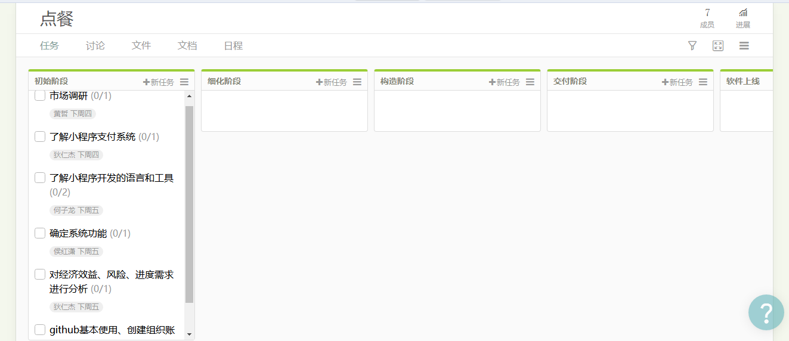
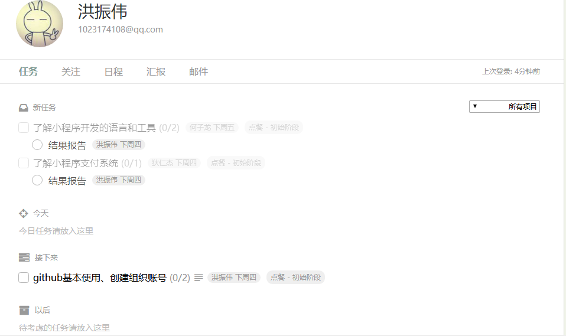

# 简单题  
### 简述瀑布模型、增量模型、螺旋模型（含原型方法）的优缺点。
* 瀑布模型： 
    * 优点：
        1. 降低软件开发的复杂程度，提高软件开发过程的透明性，提高软件开发过程的可管理性
        2. 推迟软件实现，强调在软件实现前必须进行分析和设计工作
        3. 以项目的阶段评审和文档控制为手段有效地对整个开发过程进行指导，保证了阶段之间的正确衔接，能够及时发现并纠正开发过程中存在的缺陷，使产品达到预期的质量要求
        
    * 缺点：
        1. 强调过程活动的线性顺序
        2. 缺乏灵活性，特别是无法解决软件需求不明确或不准确的问题
        3. 风险控制能力较弱
        4. 瀑布模型中的软件活动是文档驱动的，当阶段之间规定过多的文档时，会极大地增加系统的工作量
        5. 管理人员如果仅仅以文档的完成情况来评估项目完成进度，往往会产生错误的结论
* 增量模型：
    * 优点
        1. 增强客户对系统的信心
        2. 降低系统失败风险
        3. 提高系统可靠性
        4. 提高系统的稳定性和可维护性
    * 缺点
        1. 增量粒度难以选择
        2. 确定所有的基本业务服务比较困难 
* 螺旋模型（含原型方法）
    * 优点
        1. 以小的分段来构建大型系统，使成本计算变得简单容易
        2. 客户始终参与每个阶段的开发，保证了项目不偏离正确方向以及项目的可控性
    * 缺点
        1. 很难让用户确信这种演化方法的结果是可以控制的。建设周期长，而软件技术发展比较快，所以经常软件开发完毕后，和当前的技术水平有个较大的差距，无法满足当前用户需求

### 简述 UP 的三大特点，其中哪些内容体现了用户驱动的开发，哪些内容体现风险驱动的开发？
三大特点：  
1. 用例驱动（用户驱动）
2. 以体系结构为核心（风险驱动）
3. 迭代及增量（风险驱动）

### UP 四个阶段的划分准则是什么？关键的里程碑是什么？
* 四个阶段
    1. 初始阶段 (Inception)：为系统建立业务案例并确定项目的边界。
    2. 精化阶段 (Elaboration)：分析问题领域，建立健全的体系结构，编制项目计划，完成项目中高风险需求部分的开发。
    3. 构建阶段(Construction)：完成所有剩余的技术构件和稳定业务需求功能的开发，并集成为产品，详细测试所有功能。
    4. 产品交付阶段 (Transition)：确保软件对最终用户是可用的。
* 划分准则：时间和UP的核心工作流程
* 关键的里程碑分别是
    1. 生命周期里程碑：包括一些文档，如项目构想、原始用例模型、原始业务风险评估、原型等
    2. 生命周期体系结构里程碑：包括风险分析文档、软件体系结构基线、项目计划、可执行的进化原型、初始版本的用户手册等
    3. 初始运行能力里程碑：包括可运行的软件产品、用户手册等，它决定了产品是否可以在测试环境中进行部署。此刻，要确定软件、环境、用户是否可以开始系统的运行
    4. 产品发布里程碑：确定最终目标是否实现，是否应该开始产品下一版本的另一开发周期

### IT 项目管理中，“工期、质量、范围/内容” 三个元素中，在合同固定条件下，为什么说“范围/内容”是项目团队是易于控制的
1. 工期：工期是在合同里面确定好的，项目的每一个阶段都有规定的完成时间，不能随意更改。
2. 质量：客户在合同中也规定好了项目的验收条件，质量也是不由团队控制的。
3. 范围/内容：范围/内容是由团队控制的，因为只有由团队来控制，项目才能够顺利完成

### 为什么说，UP 为企业按固定节奏生产、固定周期发布软件产品提供了依据？
1. UP的软件生命周期从时间上分为四个阶段，每个阶段包括一个主要的里程碑。阶段是两个主要里程碑的分隔，在各个阶段结束时，执行评估阶段目标是否满足以决定是否进入下一个阶段。因此UP为企业按固定节奏生产提供了依据
2. UP采用迭代开发模式，RUP中的每个阶段可以进一步分解为迭代。一个迭代是一个完整的开发循环，产生一个可执行的产品版本，是最终产品的一个子集，它增量式地发展，从一个迭代过程到另一个迭代过程到成为最终的系统。因此UP为企业按固定周期发布软件产品提供了依据

# 项目管理使用
### 使用截图工具，展现你团队的任务 Kanban

