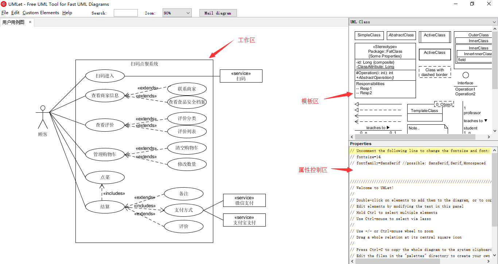
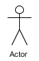
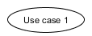
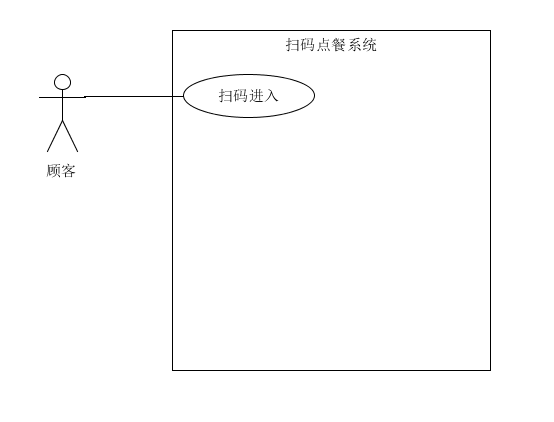
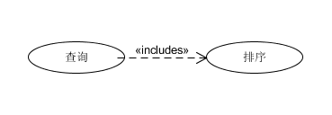
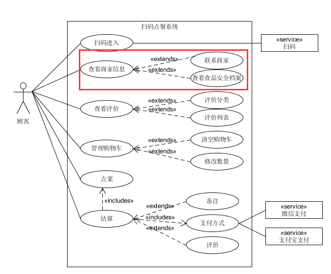

# UMLet和用例图

## 工具:UMLet

### UMLet说明

* UMLet是一个开放源代码轻量级UML建模工具，能够快速建模，并且能够导出各种格式

* UMLet是一款具有简单的用户界面，操作简单

### UMLet界面

UMLet界面如下

* 工作区：绘制UML图

* 模板区：选择UML图模板以及元素

* 属性控制区：控制UML元素的属性，例如文本、背景色

## 用例图

### 用例图简介

用例图是指由参与者（Actor）、用例（Use Case），边界以及它们之间的关系构成的用于描述系统功能的视图。用例图（User Case）是外部用户（被称为参与者）所能观察到的系统功能的模型图。用例图是系统的蓝图。用例图呈现了一些参与者，一些用例，以及它们之间的关系，主要用于对系统、子系统或类的功能行为进行建模

### 用例图组成元素

* 参与者(Actor)

  参与者不是特指人，是指系统以外的，在使用系统或与系统交互中所扮演的角色。因此参与者可以是人，可以是事物，也可以是时间或其他系统等等。

  

* 用例(Use case)

  用例是系统提供的功能或者服务

    

    每个椭圆代表一个用例，用例的设计并没有明确严格的标准，可以根据系统分析需要对用例进行设计

* 系统边界

  系统边界是用来表示正在建模系统的边界。边界内表示系统的组成部分，边界外表示系统外部。系统边界在画图中用方框来表示，同时附上系统的名称，参与者画在边界的外面，用例画在边界里面

* 关系

  用例图的关系主要有：关联，泛化，包含和扩展

  * 关联(Association)

    表示参与者与用例之间的通信，只要参与者使用了某个用例，那么这个参与者和这个用例之间就存在关联关系。  
    关联通过一条连接参与者和用例的直线来表示。

    

  * 泛化(Inheritance)

    代表一般与特殊的关系，它的意思和面向对象程序设计中的继承的概念是类似的。
    泛化用空心的实线箭头来表示，箭头从子用例指向父用例

  * 包含(Include)

    用例的行为包含了另一个用例的行为，一般用于将一个复杂用例分解为较小的用例，即要完成复杂用例必需完成较小的用例
    包含用带有include字样的虚线箭头表示

    

  * 扩展（Extend）

    拓展用于表示一些可选的功能，这些功能并不属于用例的必需点。例如系统中允许用户对查询的结果进行导出、打印。对于查询而言，能不能导出、打印查询都是一样的，导出、打印是不可见的。导出、打印和查询相对独立，而且为查询添加了新行为  
    扩展关系用带有extend字样的虚线箭头表示，箭头从子用例指向基用例

    