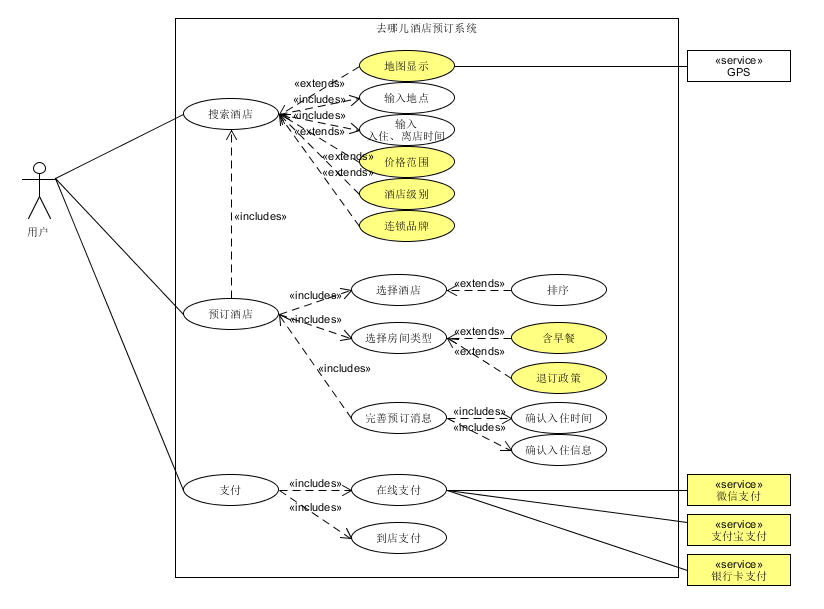
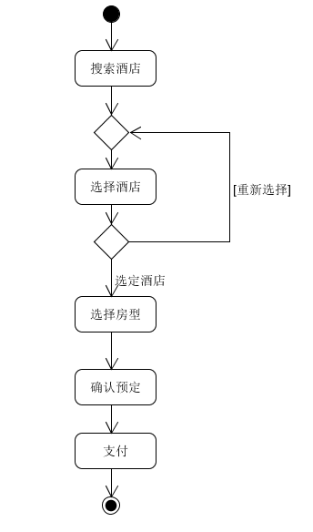
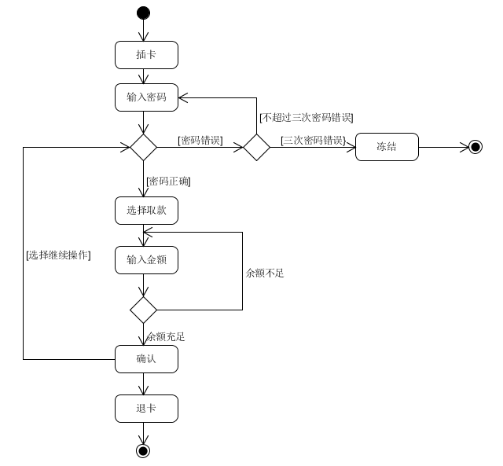
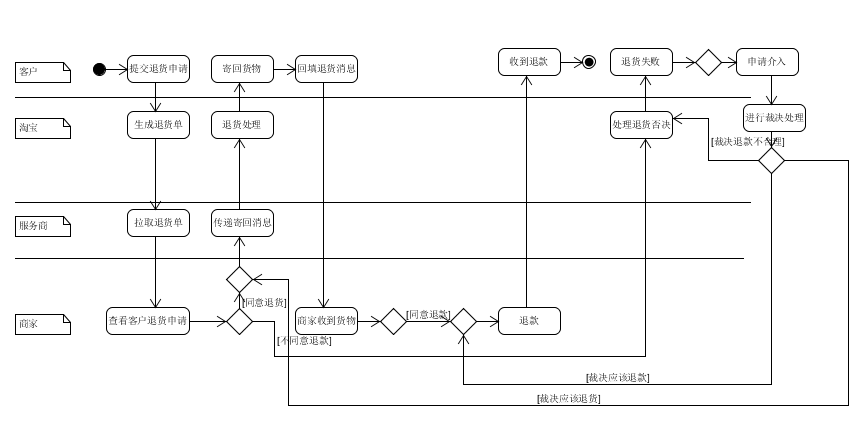

1. 用例建模
   * a. 阅读 Asg_RH 文档，绘制用例图。 按 Task1 要求，请使用工具 UMLet，截图格式务必是 png 并控制尺寸

     

   * b. 选择你熟悉的定旅馆在线服务系统（或移动 APP），如绘制用例图。并满足以下要求：

     * 对比 Asg_RH 用例图，请用色彩标注出创新用例或子用例

     * 尽可能识别外部系统，并用色彩标注新的外部系统和服务

     

   * c. 对比两个时代、不同地区产品的用例图，总结在项目早期，发现创新的思路与方法

   1. 市场调研：了解市场上用户的需求，发现用户对产品的新要求，发现同类产品不足的地方

   2. 新技术应用：将合适新技术应用到产品上，提高产品的易用性，满足用户的新需求

   * d. 请使用 SCRUM 方法，在（任务b）用例图基础上，编制某定旅馆开发的需求 （backlog）
      | 编号 | 名称 | 重要性 | 预计工作量 | 故事描述 |
      | :--: | :--: | :--: | :--: | :--: |
      | 0 | 搜索酒店 | 9 | 10 | 用户输入城市，入住时间搜索酒店 |
      | 1 | 选择酒店 | 7 | 8 | 用户从酒店列表中选择酒店，可借助刷选帮助选择 |
      | 2 | 选择房型 | 7 | 8 | 用户选则酒店后，进入酒店房间类型选择界面 |
      | 3 | 确认预订 | 10 | 6 | 用户选择好房型后，进入预定界面，完善入住信息，提交订单 |
      | 4 | 在线支付 | 8 | 6 | 用户提交订单后，进行支付 |

2. 业务建模

   * a. 在（任务b）基础上，用活动图建模找酒店用例。简述利用流程图发现子用例的方法。

     

   * b. 选择你身边的银行 ATM，用活动图描绘取款业务流程

     

   * c. 查找淘宝退货业务官方文档，使用多泳道图，表达客户、淘宝网、淘宝商家服务系统、商家等用户和系统协同完成退货业务的过程。分析客户要完成退货业务，在淘宝网上需要实现哪些系统用例

     

3. 用例文本编写

   * 在大作业基础上，分析三种用例文本的优点和缺点

      1. 摘要：简洁的一段式概要，通常用于主成功场景
         * 优点：简洁明了，快速编写
         * 缺点：不够细致

      2. 非正式：用几个段落覆盖不同场景
         * 优点：编写简便，比摘要式用例文本详细一些，有利于进一步认识问题
         * 缺点： 不够正式，需要在后续阶段精化
      3. 详述，即详细地编写用例所有步骤和各种变化，同时具有补充部分
         * 优点：细节充足，正式，具有结构性 
         * 缺点：编写耗时长，繁琐
