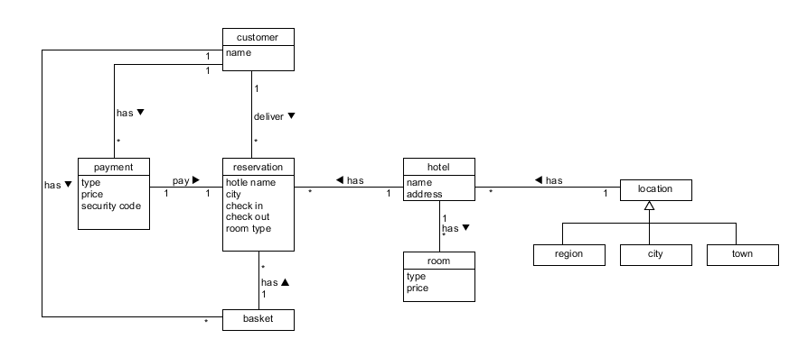
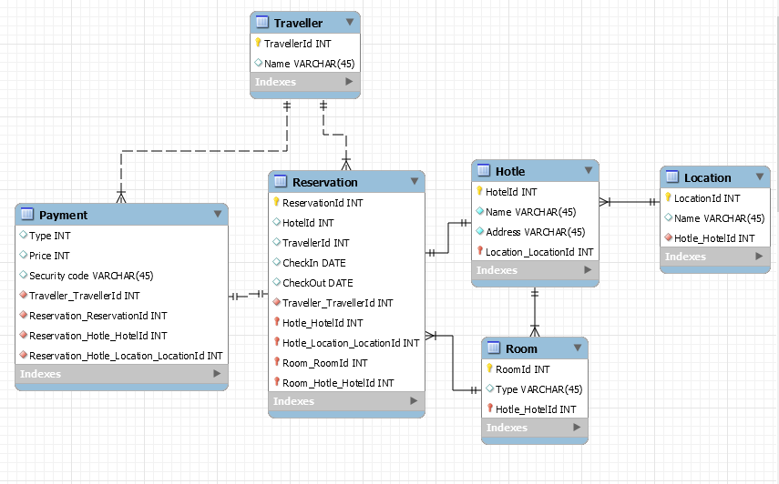

1. 领域建模
   * a. 阅读 Asg_RH 文档，按用例构建领域模型
      * 按 Task2 要求，请使用工具 UMLet，截图格式务必是 png 并控制尺寸
      * 说明：请不要受 PCMEF 层次结构影响。你需要识别实体（E）和 中介实体（M，也称状态实体）
        * 在单页面应用（如 vue）中，E 一般与数据库构建有关， M 一般与 store 模式 有关
        * 在 java web 应用中，E 一般与数据库构建有关， M 一般与 session 有关

     

   * b. 数据库建模(E-R 模型)
      * 按 Task 3 要求，给出系统的 E-R 模型（数据逻辑模型）
      建模工具 PowerDesigner（简称PD） 或开源工具 OpenSystemArchitect
      * 不负责的链接http://www.cnblogs.com/mcgrady/archive/2013/05/25/3098588.html
      * 导出 Mysql 物理数据库的脚本
      * 简单叙说 数据库逻辑模型 与 领域模型 的异同

     

      sql脚本

      ```sql
      -- MySQL Script generated by MySQL Workbench
      -- Sun Apr 29 21:30:30 2018
      -- Model: New Model    Version: 1.0
      -- MySQL Workbench Forward Engineering

      CREATE SCHEMA IF NOT EXISTS `mydb` DEFAULT CHARACTER SET utf8 ;
      USE `mydb` ;

      -- -----------------------------------------------------
      -- Table `mydb`.`Location`
      -- -----------------------------------------------------
      CREATE TABLE IF NOT EXISTS `mydb`.`Location` (
        `LocationId` INT NOT NULL,
        `Name` VARCHAR(45) NULL,
        `Hotle_HotelId` INT NOT NULL,
        PRIMARY KEY (`LocationId`),
        INDEX `fk_Location_hotle_idx` (`Hotle_HotelId` ASC),
        CONSTRAINT `fk_Location_hotle`
          FOREIGN KEY (`Hotle_HotelId`)
          REFERENCES `mydb`.`Hotle` (`HotelId`)
          ON DELETE NO ACTION
          ON UPDATE NO ACTION)
      ENGINE = InnoDB;

      -- -----------------------------------------------------
      -- Table `mydb`.`Hotle`
      -- -----------------------------------------------------
      CREATE TABLE IF NOT EXISTS `mydb`.`Hotle` (
        `HotelId` INT NOT NULL,
        `Name` VARCHAR(45) NOT NULL,
        `Address` VARCHAR(45) NOT NULL,
        `Location_LocationId` INT NOT NULL,
        PRIMARY KEY (`HotelId`, `Location_LocationId`),
        INDEX `fk_hotle_Location1_idx` (`Location_LocationId` ASC),
        CONSTRAINT `fk_hotle_Location1`
          FOREIGN KEY (`Location_LocationId`)
          REFERENCES `mydb`.`Location` (`LocationId`)
          ON DELETE NO ACTION
          ON UPDATE NO ACTION)
      ENGINE = InnoDB;

      -- -----------------------------------------------------
      -- Table `mydb`.`Room`
      -- -----------------------------------------------------
      CREATE TABLE IF NOT EXISTS `mydb`.`Room` (
        `RoomId` INT NOT NULL,
        `Type` VARCHAR(45) NULL,
        `Hotle_HotelId` INT NOT NULL,
        PRIMARY KEY (`RoomId`, `Hotle_HotelId`),
        INDEX `fk_room_hotle1_idx` (`Hotle_HotelId` ASC),
        CONSTRAINT `fk_room_hotle1`
          FOREIGN KEY (`Hotle_HotelId`)
          REFERENCES `mydb`.`Hotle` (`HotelId`)
          ON DELETE NO ACTION
          ON UPDATE NO ACTION)
      ENGINE = InnoDB;

      -- -----------------------------------------------------
      -- Table `mydb`.`Traveller`
      -- -----------------------------------------------------
      CREATE TABLE IF NOT EXISTS `mydb`.`Traveller` (
        `TravellerId` INT NOT NULL,
        `Name` VARCHAR(45) NULL,
        PRIMARY KEY (`TravellerId`))
      ENGINE = InnoDB;

      -- -----------------------------------------------------
      -- Table `mydb`.`Reservation`
      -- -----------------------------------------------------
      CREATE TABLE IF NOT EXISTS `mydb`.`Reservation` (
        `ReservationId` INT NOT NULL,
        `HotelId` INT NULL,
        `TravellerId` INT NULL,
        `CheckIn` DATE NULL,
        `CheckOut` DATE NULL,
        `Traveller_TravellerId` INT NOT NULL,
        `Hotle_HotelId` INT NOT NULL,
        `Hotle_Location_LocationId` INT NOT NULL,
        `Room_RoomId` INT NOT NULL,
        `Room_Hotle_HotelId` INT NOT NULL,
        PRIMARY KEY (`ReservationId`, `Hotle_HotelId`, `Hotle_Location_LocationId`, `Room_RoomId`, `Room_Hotle_HotelId`),
        INDEX `fk_Reservation_Traveller1_idx` (`Traveller_TravellerId` ASC),
        INDEX `fk_Reservation_Hotle1_idx` (`Hotle_HotelId` ASC, `Hotle_Location_LocationId` ASC),
        INDEX `fk_Reservation_Room1_idx` (`Room_RoomId` ASC, `Room_Hotle_HotelId` ASC),
        CONSTRAINT `fk_Reservation_Traveller1`
          FOREIGN KEY (`Traveller_TravellerId`)
          REFERENCES `mydb`.`Traveller` (`TravellerId`)
          ON DELETE NO ACTION
          ON UPDATE NO ACTION,
        CONSTRAINT `fk_Reservation_Hotle1`
          FOREIGN KEY (`Hotle_HotelId` , `Hotle_Location_LocationId`)
          REFERENCES `mydb`.`Hotle` (`HotelId` , `Location_LocationId`)
          ON DELETE NO ACTION
          ON UPDATE NO ACTION,
        CONSTRAINT `fk_Reservation_Room1`
          FOREIGN KEY (`Room_RoomId` , `Room_Hotle_HotelId`)
          REFERENCES `mydb`.`Room` (`RoomId` , `Hotle_HotelId`)
          ON DELETE NO ACTION
          ON UPDATE NO ACTION)
      ENGINE = InnoDB;


      -- -----------------------------------------------------
      -- Table `mydb`.`Payment`
      -- -----------------------------------------------------
      CREATE TABLE IF NOT EXISTS `mydb`.`Payment` (
        `Type` INT NULL,
        `Price` INT NULL,
        `Security code` VARCHAR(45) NULL,
        `Traveller_TravellerId` INT NOT NULL,
        `Reservation_ReservationId` INT NOT NULL,
        `Reservation_Hotle_HotelId` INT NOT NULL,
        `Reservation_Hotle_Location_LocationId` INT NOT NULL,
        INDEX `fk_Payment_Traveller1_idx` (`Traveller_TravellerId` ASC),
        INDEX `fk_Payment_Reservation1_idx` (`Reservation_ReservationId` ASC, `Reservation_Hotle_HotelId` ASC, `Reservation_Hotle_Location_LocationId` ASC),
        CONSTRAINT `fk_Payment_Traveller1`
          FOREIGN KEY (`Traveller_TravellerId`)
          REFERENCES `mydb`.`Traveller` (`TravellerId`)
          ON DELETE NO ACTION
          ON UPDATE NO ACTION,
        CONSTRAINT `fk_Payment_Reservation1`
          FOREIGN KEY (`Reservation_ReservationId` , `Reservation_Hotle_HotelId` , `Reservation_Hotle_Location_LocationId`)
          REFERENCES `mydb`.`Reservation` (`ReservationId` , `Hotle_HotelId` , `Hotle_Location_LocationId`)
          ON DELETE NO ACTION
          ON UPDATE NO ACTION)
      ENGINE = InnoDB;

      ```

      数据库逻辑模型 与 领域模型 的异同:
      * 异：数据库逻辑模型更加关注细节，考虑模型的具体实现，领域模型更关注实体间的逻辑关系而不负责细节实现
      * 同：都描述了实体之间的关系
