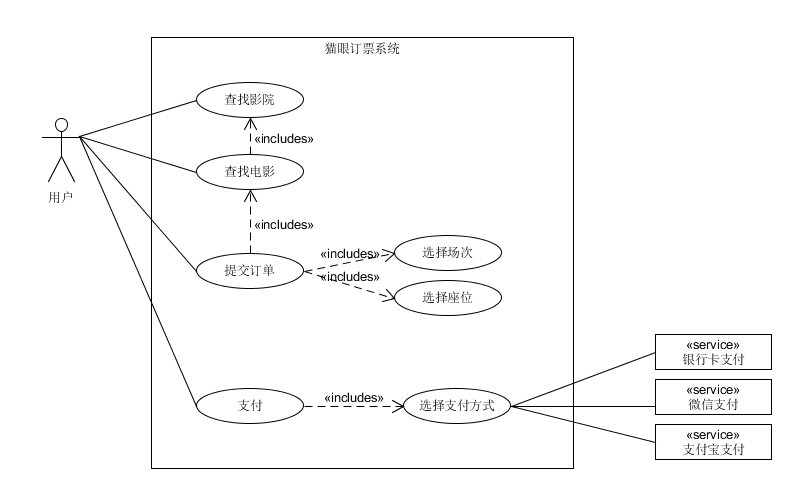
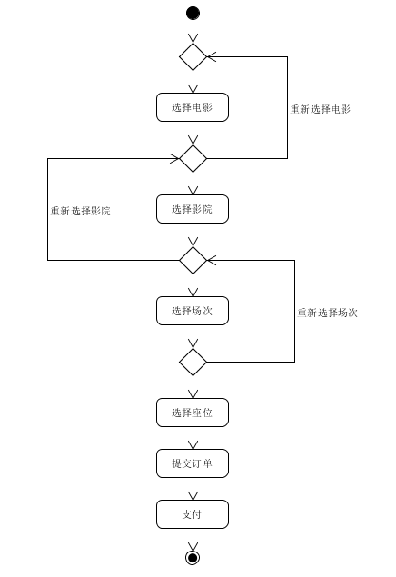
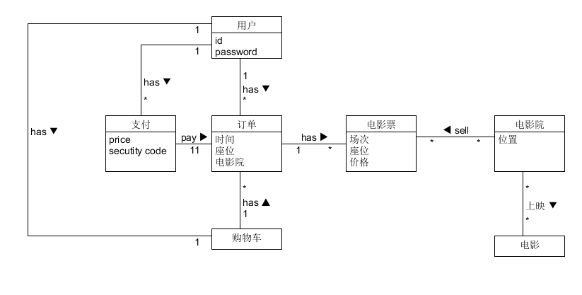
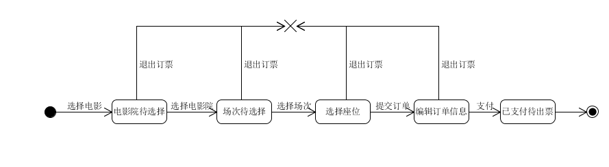
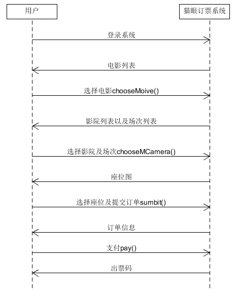

1. 建模练习
   * 练习文档编写
      * 选择一个你喜欢的 移动App 或 其中某业务
      * 参考 Asg_RH 文档格式 编写软件描述
      * 文档要包含一个业务的完整过程
   * 建模要求包括（用例图、XX业务或用例的活动图、XX领域模型、XX对象的状态图、XX场景的系统顺序图与操作协议）
   
   文档链接

   https://linjinghua.github.io/application-description/

   用例图

   

   活动图

   

   领域模型

   

   状态图

   

   系统顺序图

   