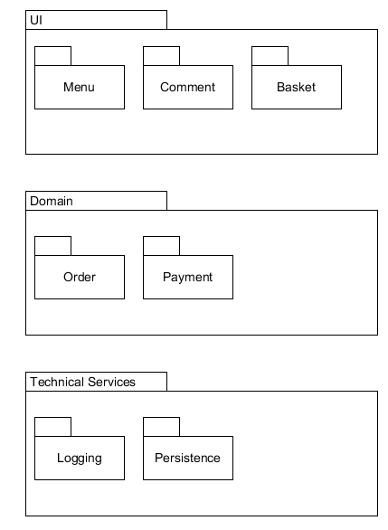
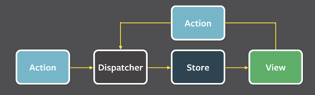
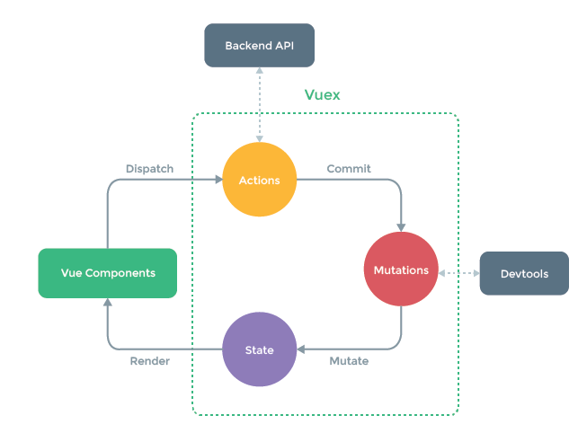

1.描述软件架构与框架之间的区别与联系

* 定义：

  * 软件架构：软件架构是一个系统的草图。软件架构描述的对象是直接构成系统的抽象组件。各个组件之间的连接则明确和相对细致地描述组件之间的通讯。设计软件架构就是把系统分解为一些部件，描述这些部件的职责及它们之间的协作行为。
  * 软件框架：软件框架是面向领域（如 ERP、计算领域等）的、可复用的“半成品”软件，它实现了该领域的共性部分，并提供了一些定义良好的可变点以保证灵活性和可扩展性。也就是说软件框架是领域分析结果的软件化，是领域内最终应用的模板，是特定语言和技术的架构应用解决方案。

* 区别：
  * 软件架构不是软件，而是关于软件如何设计的重要决策。软件架构决策涉及到如何将软件系统分解成不同的部分、各部分之间的静态结构关系和动态交互关系等。经过完整的开发过程之后，这些架构决策将体现在最终开发出的软件系统中；当然，引入软件框架之后，整个开发过程变成了“分两步走”，而架构决策往往会体现在框架之中。
  * 框架是一种特殊的软件，它并不能提供完整无缺的解决方案，而是为你构建解决方案提供良好的基础。框架是半成品。典型地，框架是系统或子系统的半成品；框架中的服务可以被最终应用系统直接调用，而框架中的扩展点是供应用开发人员定制的“可变化点”

* 联系：
  * 软件架构是引导如何设计软件框架的重要决策。它决定了软件系统如何划分，在一定程度上描述了被划分的各个部分之间的静态、动态关系。软件架构的决策体现在软件系统的框架中

2.以你的项目为案例

* 绘制三层架构模型图，细致到分区

  

* 结合你程序的结构，从程序员角度说明三层架构给开发者带来的便利

  * 三层架构降低了耦合度，提高了复用性，而且将模块划分得更加清晰，便于分工开发，提高团队开发效率
  * 每个层次之间定义接口，层次内部实现不关注，便于层内实现的修改，也有效提高了系统的可扩展性

3.研究 VUE 与 Flux 状态管理的异同
  
* 同：Flux 是一种架构思想，专门解决软件的结构问题。Flux和Vue中的vuex思想基本相同，因为Vuex就是借鉴的Flux
* 异：
  * Flux将一个应用分成四个部分
    * View： 视图层
    * Action（动作）：视图层发出的消息（比如mouseClick）
    * Dispatcher（派发器）：用来接收Actions、执行回调函数
    * Store（数据层）：用来存放应用的状态，一旦发生变动，就提醒Views要更新页面

    

    Flux 的最大特点，就是数据的"单向流动"。
    1. 用户访问 View
    2. View 发出用户的 Action
    3. Dispatcher 收到 Action，要求 Store 进行相应的更新
    4. Store 更新后，发出一个"change"事件
    5. View 收到"change"事件后，更新页面

    Flux数据流的顺序是:

    View发起Action->Action传递到Dispatcher->Dispatcher将通知Store->Store的状态改变通知View进行改变
  * Vue

    
    
    Vuex状态变更相当于是 action 产生的副作用，mutation 的作用是将这些副作用记录下来，这样就形成了一个完整数据流闭环，数据流的顺序如下：

      1. 在视图中触发 action，并根据实际情况传入需要的参数。

      2. 在 action 中触发所需的 mutation，在 mutation 函数中改变 state。

      3. 通过 getter/setter 实现的双向绑定会自动更新对应的视图。

    Vuex数据流的顺序是:

    View调用store.commit提交对应的请求到Store中对应的mutation函数->store改变(vue检测到数据变化自动渲染)