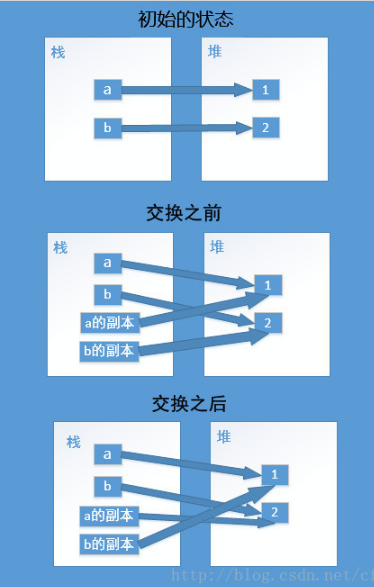

#java中的swap函数编写问题

1. java中只有值传递，包括引用也是采取值传递，作为参数传递到函数里只是实参的副本。对于基本类型只是拷贝一个副本，函数里对参数的任意操作无法影响到函数外的变量；对于引用，拷贝了指向堆对象的引用，函数内只有修改堆对象空间的操作才能使得函数外对象一同变化，只对引用副本进行操作无法使得函数外对象一同变化

2. 内存模型如下
  
   

3. 对于基本数据类型的swap，可以采用参数为数组或返回为数组的方法实现swap

4. 对于参数类型为stringBuilder的swap，错误写法直接赋值，可行写法为使用stringBuilder.replace()方法

   *可行写法

   ```java
    public static void swap(StringBuilder a, StringBuilder b) {
        StringBuilder temp = new StringBuilder(a.toString());
        a.replace(0,b.length(),b.toString());
        b.replace(0,temp.length(),temp.toString());
    }
   ```

    *错误写法

    ```java
    public static void swap(StringBuilder a, StringBuilder b) {
        StringBuilder temp = a;
        a = b;
        b = temp;
    }
    ```

    *replace方法可行的分析
    先贴上stringBuilder.replace()的源码

    ```java
    public AbstractStringBuilder replace(int start, int end, String str) {
        if (start < 0)
            throw new StringIndexOutOfBoundsException(start);
        if (start > count)
            throw new StringIndexOutOfBoundsException("start > length()");
        if (start > end)
            throw new StringIndexOutOfBoundsException("start > end");
        if (end > count)
            end = count;
        int len = str.length();
        int newCount = count + len - (end - start);
        ensureCapacityInternal(newCount);
        System.arraycopy(value, end, value, start + len, count - end);
        str.getChars(value, start);
        count = newCount;
        return this;
    }
    ```
    可以看到调用了System.arraycopy()方法进行字符串修改操作，因为stringBuilder是采用char[] value字符数组来表示字符串，所以可以通过对数组的修改达到对字符串的修改，这种修改直接作用在堆对象空间上而不是栈引用

    顺便贴上System.arraycopy()的语法

    ```java
    public static void arraycopy(Object src,
                             int srcPos,
                             Object dest,
                             int destPos,
                             int length)
    ```
    * Object src : 原数组
    * int srcPos : 从元数据的起始位置开始
    * Object dest : 目标数组
    * int destPos : 目标数组的开始起始位置
    * int length  : 要copy的数组的长度

参考链接：

[java中的swap](https://blog.csdn.net/cflys/article/details/71102021)

[String、StringBuffer、StringBuilder源码解读](https://www.cnblogs.com/snifferhu/p/5903958.html)