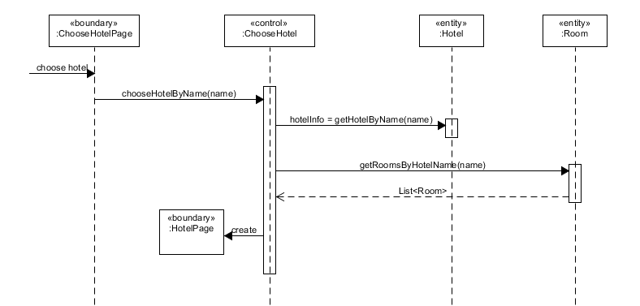
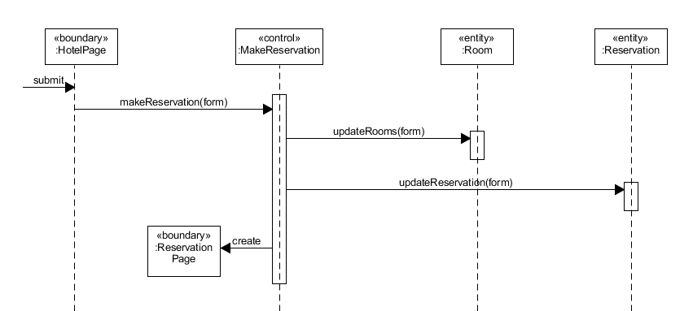
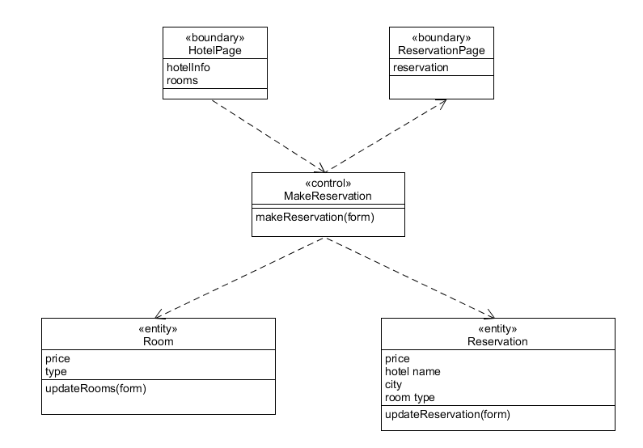

1. 使用 ECB 实现 make reservation 用例的详细设计（包含用例简介，顺序图，类图）
  
   * search hotel

      * 用例简述：用户提交包含地点、入住时间、退房时间的表单，获得满足条件的旅馆列表
      * 顺序图

        

      * 类图

        

   * choose hotel

      * 用例简述：用户选择旅馆进入旅馆界面
      * 顺序图

        

      * 类图

        

   * make reservation

      * 用例简述：用户选择旅馆房间类型和数量并提交，获得订单
      * 顺序图

        

      * 类图

        

2. 将逻辑设计类图映射到实际项目框架的包图。用树形结构表述实现的包和类
  
   