# final report

## author: hzw 15331103  github : hongzhw

- [自我总结](#自我总结)
- [PSP 2.1 统计表](#psp-21-统计表)
- [个人GITt统计报告](#个人gitt统计报告)
  - [文档部分 （Dashboard仓库）](#文档部分-dashboard仓库)
  - [商家后台管理系统代码 （merchant-manage-system仓库）](#商家后台管理系统代码-merchant-manage-system仓库)
  - [服务端代码 （Server仓库）](#服务端代码-server仓库)
- [最得意/或有价值/或有苦劳的工作清单](#最得意或有价值或有苦劳的工作清单)
- [个人的技术类、项目管理类博客清单](#个人的技术类项目管理类博客清单)

### 自我总结

1. 学习了go语言；了解了微信小程序的开发，和web开发类似

2. 对项目的分析有更多的练习，学到UML语言以及各种文档，包括用例设计、活动图、顺序图、类图、领域模型、数据库设计等

3. 小组任务首先要统一目标和态度，做到什么样要有统一的认识；小组任务一定要分配好工作并规格好ddl，如果能采取工作汇报的形式有助于推进进程

4. 感谢@mohkh和@zheever最先开始编码工作并给后来者的我提供了很多帮助

### PSP 2.1 统计表

| PSP 2.1 | Personal Software Process Stages | Time/h |
| - | - | - |
| **Planning** | **计划** | **2** |
| -　Estimate | -估计这个任务需要多少时间  | 2 |
| **Development** | **开发** | **77** |
| -　Analysis | -需求分析（包括学习新技术） | 14 |
| -　Design Spec | -生成设计文档 | 14 |
| -　Design Review | -设计复审（和同事审核设计文档） | 2 |
| -　Coding Standard | -代码规范（为目前的开发制定合适的规范） | 1 |
| -　Design | -具体设计 | 8 |
| -　Coding| -具体编码 | 18 |
| -　Code Review | -代码复审 | 5 |
| -　Test | 测试（自我测试，修改代码，提交修改） | 15 |
| **Report** | **报告** | **5** |
| -　Test Report | 测试报告 | 2 |
| -　Size Measurement| 计算工作量 | 2 |
| -　Postmortem & Process Improvement Plan| -事后总结，并提出过程改进计划| 1 |

### 个人GITt统计报告

#### 文档部分 （Dashboard仓库）

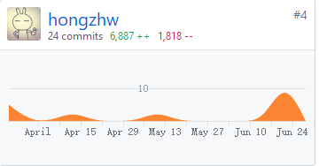

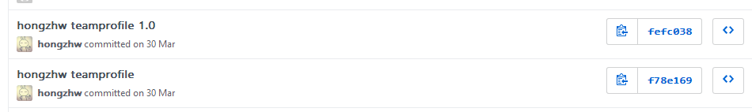

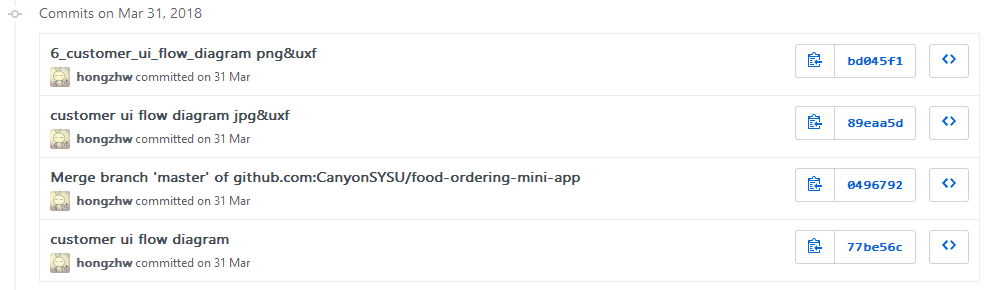

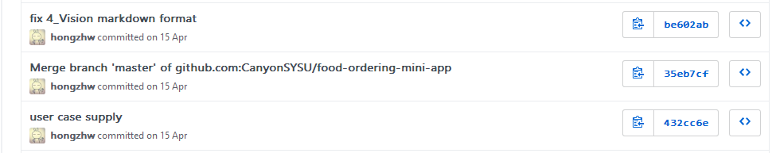

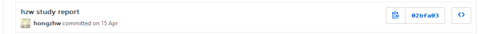

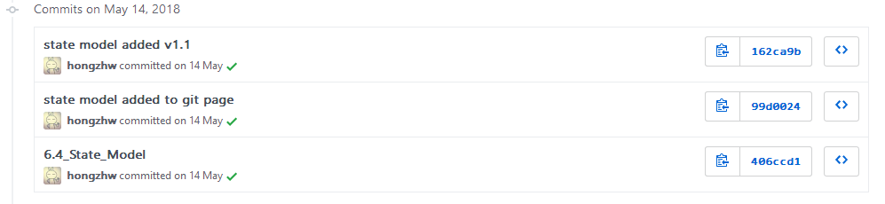

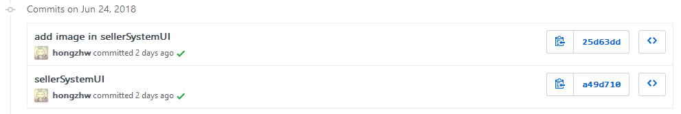

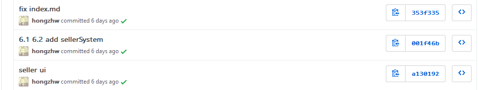

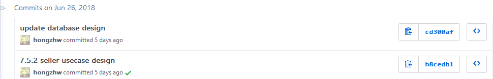

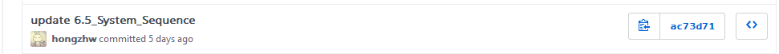

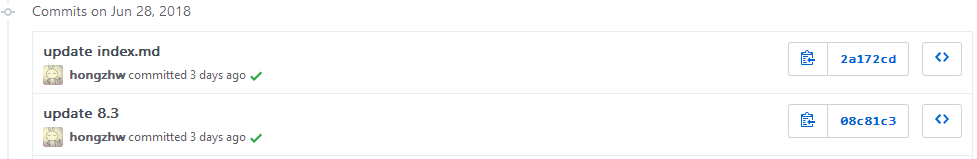

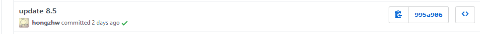

#### 商家后台管理系统代码 （merchant-manage-system仓库）

16955行添加中有16491行是架构代码，465行才是自己coding

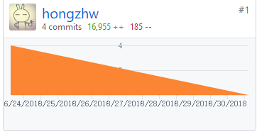

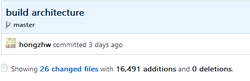

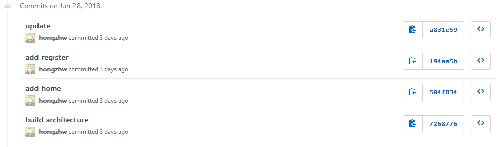

#### 服务端代码 （Server仓库）

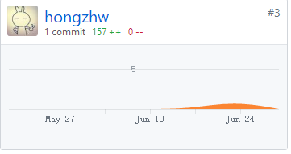

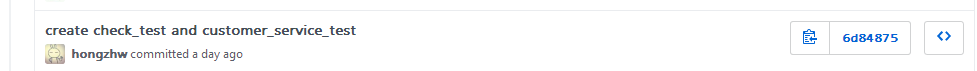

### 最得意/或有价值/或有苦劳的工作清单

| 工作 | 说明 |
| :--: | :--: |
| 任务分配 | 分派好任务，规定ddl并进行每日工作汇报，推进项目 |
| 商家端文档撰写 | 负责了商家端的ui设计、用例图、活动图、顺序图、类图文档编写 |
| 用户端文档 | 负责了用户端的用例图、状态模型 |
| 服务端测试代码 | 负责服务端check模块实现及测试，并参与customer数据库操作测试 |

### 个人的技术类、项目管理类博客清单

| 博客 |
| :--: |
|[UML用例图学习](https://github.com/hongzhw/hongzhw.github.io/blob/master/_posts/2018-04-15-assigment3.md) |
