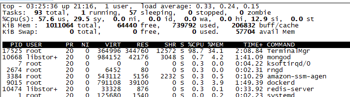

# Http压力测试之wrk工具的使用

<!-- TOC -->

- [Http压力测试之wrk工具的使用](#http%E5%8E%8B%E5%8A%9B%E6%B5%8B%E8%AF%95%E4%B9%8Bwrk%E5%B7%A5%E5%85%B7%E7%9A%84%E4%BD%BF%E7%94%A8)
    - [wrk的使用方法](#wrk%E7%9A%84%E4%BD%BF%E7%94%A8%E6%96%B9%E6%B3%95)
    - [wrk使用经历](#wrk%E4%BD%BF%E7%94%A8%E7%BB%8F%E5%8E%86)
    - [wrk参数解读](#wrk%E5%8F%82%E6%95%B0%E8%A7%A3%E8%AF%BB)

<!-- /TOC -->

## wrk的使用方法

wrk的使用[Http压测工具wrk使用指南](https://www.cnblogs.com/jiftle/p/7158291.html)这篇文章已经写得很详细了，这里不再赘述，这篇博客主要讲一讲自己做压力测试过程中出现的错误操作以及自己的一些体会

[wrk github账号](https://github.com/wg/wrk)

## wrk使用经历

1. 在进行压力测试之前，可以先把线程数t和连接数c调小（进行压测的时候一般线程数设置为cpu核心数的1-2倍，连接数不能小于线程数），并打印返回结果验证请求是否正确。打印返回结果可以执行简单的lua脚本（一定要做这一步请求正确的验证，不进行验证都不知道是否正确请求了测试接口，利用好response）

    当返回结果是正确的时候，这时候为了方便看结果可以把脚本中打印返回的代码注释掉，并且提高线程数和连接数来进行真正的压力测试，比如把连接数增加到10000

    示例：

    测试：

    ./wrk `www.example.com` -t4 -c10 -s response.lua
    (在wrk文件目录下执行命令)

    ```lua
    --这段代码保存在response.lua中
    function response(status, headers, body)
        print("response...")
        --print(status)
        --print(headers)
        print(body)
    end
    ```

2. 使用-d参数，对被测试机器持续请求，能够更好地保存被测试机器的性能状态。-d参数表示持续压测时间

    示例：

    

3. 善用脚本提高测试速度，降低操作错误

    例如，要测试`https://www.hello.com/api/v1/register`和`https://www.hello.com/api/v1/list`这两个接口，一种方法是直接在命令行分两次键入

    ./wrk `https://www.example.com/api/v1/register` -t2 -c10

    ./wrk `https://www.example.com/api/v1/list` -t2 -c10

    但显然这种方法不是很方便，如果要测试更多的接口就要不断地修改命令，而且接口可能很长，需要修改的部分就会很多，既降低了效率，也提高了出错的几率。所以就建议下面这种方法：

    使用lua脚本，将要测试的接口路径写到wrk.path里，命令行命令只保留被测试服务器的域名或ip地址，这样测试不同的接口只需要修改-s参数。有多少个接口需要测试就生成多少个lua脚本，既方便管理，又不用修改一大堆命令

    示例：

    ./wrk `https://www.example.com` -s register.lua -t2 -c10

    ./wrk `https://www.example.com` -s list.lua -t2 -c10

    ```lua
    function request()
        wrk.method = "GET"
        wrk.header = "hello"
        --wrk.path = "/api/v1/register"
        wrk.path = "/api/v1/list"
        return wrk.format()
    end
    ```

4. 做测试要保持参数一致，一个接口的参数设置为-t8 -c1000，则其他接口也用这样的参数，不要一个-t8 -c1000，一个-t16 -c2000。做多组实验的时候要做好统计记录，可以做个表格，例如：

    |接口|请求方式|t|c|TPS（并发量）|
    |-|-|-|-|-|
    |list|GET|8|1000|
    |list|GET|8|2000|

5. 做压力测试可以借助netdata来观察服务器性能情况（当然也可以在服务器上用top指令来看cpu、内存使用情况和服务器负载情况），netdata的安装网上已经有较多的教程，这里不再赘述。本文想提醒的是装好了nettdata后要查看自己服务器的防火墙安全组的情况，查看netdata默认端口19999是否开放。

## wrk参数解读

1. 在wrk的github账号上，我们可以看到wrk的使用说明以及参数说明，其中对-c参数wrk是这样解释的

    > -c, --connections: total number of HTTP connections to keep open with each thread handling N = connections/threads

    这句话翻译过来就是“-c是总的HTTP连接数，每个线程处理（连接数/线程数）个连接”，通过实验，发现了连接数和请求数并不相同，猜想wrk的HTTP连接是长连接