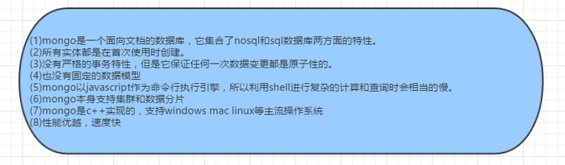

# 2018.8.13工作复盘

1. 10:20-11:50 
2. 13:50-18:00 添加日活和月活统计表；尝试在原活跃设备表的基础上进行月活统计并去重，即一台设备在一个月内只算一次活跃度；思考如何做周活
3. 19:00-21:00 学习mongo相关知识

* 周活：能够获得日期对应的年、周，问题在于将日期转成周第一天再分组来进行统计，或者得到周第一天和最后一天的日期进行对周循环做日期筛选
* 去重效果：对client_type和time分组后对tid去重
    * 月活未去重前
        |client_type|time|tid|
        |-|-|-|
        |a|2018-12-01|t1|
        |a|2018-12-02|t1|
        |b|2018-12-01|t2|
    * 去重后
        |client_type|time|tid|
        |-|-|-|
        |a|2018-12-01|t1|
        |b|2018-12-01|t2|

* mongo数据库使用流程
    * 创建一个连接数据库session
    * 使用指定数据库(database)和集合(collection)
    * 执行操作

* db.collection.stats()查看表状态
* mongo 索引放在内存里，有大小限制
* hint指定索引，explain查看查询状态

相关链接：

[golang mgo 使用](http://www.fecshop.com/topic/883)
对mongodb配置进行封装

[mongodb官方 go使用博客](https://www.mongodb.com/blog/post/running-mongodb-queries-concurrently-with-go)

[GoDoc package mgo](https://godoc.org/gopkg.in/mgo.v2)

